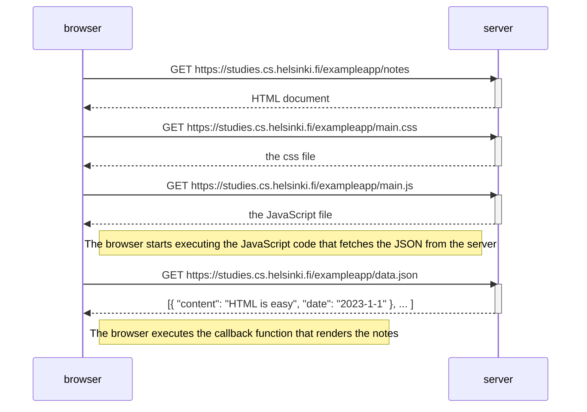
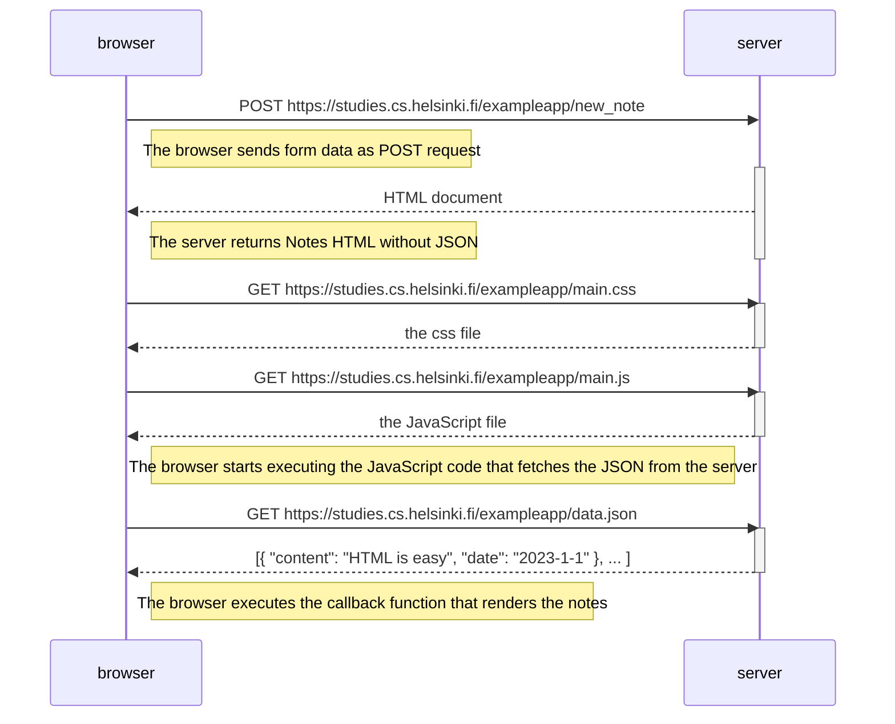
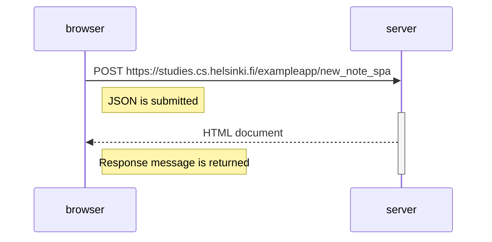

# part 0 diagrams

# simple mermaid example
Here is a simple flow chart:

# example from course
the chain of events caused by opening the page https://studies.cs.helsinki.fi/exampleapp/notes:

# 0.4: New note diagram
the chain of events caused by opening the page https://studies.cs.helsinki.fi/exampleapp/notes:

# 0.5: Single page app diagram
the chain of events caused by opening the page https://studies.cs.helsinki.fi/exampleapp/spa:

# 0.6: New Note in single page app diagram
the chain of events caused by opening the page https://studies.cs.helsinki.fi/exampleapp/spa:

